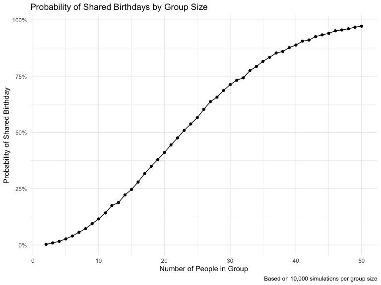
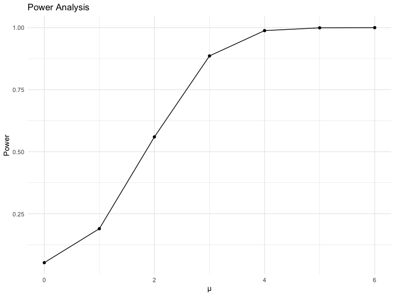
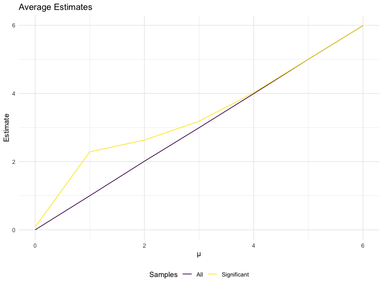
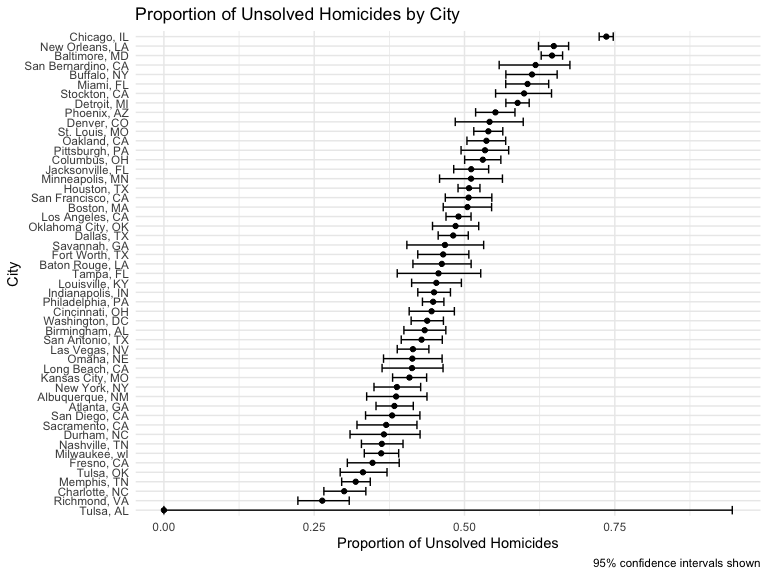

p8105_hw5_yg2964
================
2024-11-14

### Problem 1

Function to simulate birthdays and check for duplicates

``` r
bday_sim = function(n){
bdays = sample(1:365, size = n, replace=TRUE)

duplicate = length(unique(bdays))<n
return(duplicate)
}
```

Run simulations for group sizes 2 to 50

``` r
sim_res =
  expand_grid(
    n = 2:50,
    iter = 1:10000
  ) |> 
  mutate(res = map_lgl(n,bday_sim)) |> 
  group_by(n) |> 
  summarize(probability = mean(res))
```

Create visualization

``` r
sim_res |>
  ggplot(aes(x = n, y = probability)) +
  geom_line() +
  geom_point() +
  labs(
    title = "Probability of Shared Birthdays by Group Size",
    x = "Number of People in Group",
    y = "Probability of Shared Birthday",
    caption = "Based on 10,000 simulations per group size"
  ) +
  scale_y_continuous(labels = scales::percent)
```


The plot clearly illustrates the famous “birthday paradox” showing the
probability of shared birthdays as group size increases. The probability
grows surprisingly quickly: with just 23 people, there’s already a 50%
chance of a shared birthday, rising to about 70% with 30 people, and
exceeding 85% with 40 people. This counter-intuitive result shows how we
typically underestimate the probability of birthday matches in
relatively small groups. The simulation, run 10,000 times per group
size, presents these findings in a clear way.

### Problem 2

Function to generate data and perform t-test

``` r
alpha <- 0.05
t_test_sim <- function(mu) {
  sample_data <- rnorm(30, mean = mu, sd = 5)
  t.test(sample_data, mu = 0) |>
    broom::tidy() |>
    select(estimate, p.value)
}
```

Generate data for mu = 0

``` r
results_mu0 <- 
  tibble(
    mu = 0,
    iteration = 1:5000
  ) |>
  mutate(
    test_results = map(mu, t_test_sim)
  ) |>
  unnest(test_results)
```

Generate data for mu = 1 to 6

``` r
results_mu1to6 <- 
  expand_grid(
    mu = 1:6,
    iteration = 1:5000
  ) |>
  mutate(
    test_results = map(mu, t_test_sim)
  ) |>
  unnest(test_results)
```

Combine results

``` r
simulation_results <- bind_rows(results_mu0, results_mu1to6)
```

Plot 1: Power vs True mu

``` r
simulation_results |>
  group_by(mu) |>
  summarize(
    power = mean(p.value < alpha)
  ) |>
  ggplot(aes(x = mu, y = power)) +
  geom_line() +
  geom_point() +
  labs(
    title = "Power Analysis",
    x = "μ",
    y = "Power"
  )
```


Comment: Based on the plot, there is a strong positive, non-linear
association between effect size (μ) and power. The relationship follows
an S-shaped curve, starting at around 0.05 when μ = 0, increasing
sharply between μ = 2 and μ = 4, and then leveling off as power
approaches 1.0 for larger effect sizes, demonstrating that larger
effects are more easily detected up to a certain point.

Plot 2: Average Estimates

``` r
simulation_results |>
  group_by(mu) |>
  summarize(
    all_mean = mean(estimate),
    sig_mean = mean(estimate[p.value < alpha])
  ) |>
  ggplot() +
  geom_line(aes(x = mu, y = all_mean, color = "All")) +
  geom_line(aes(x = mu, y = sig_mean, color = "Significant")) +
  labs(
    title = "Average Estimates",
    x = "μ",
    y = "Estimate",
    color = "Samples"
  )
```


Comment: No, the sample average of μ̂ across tests where the null is
rejected (yellow line) is not approximately equal to the true value of
μ, particularly for smaller true values of μ. This is due to selection
bias: when we only look at tests that rejected the null hypothesis, we
are systematically selecting samples that showed larger effects than
average, leading to overestimation of the true effect size, especially
when μ is small.

### Problem 3

Read data directly from GitHub raw URL

``` r
homicide_data <- read_csv("https://raw.githubusercontent.com/washingtonpost/data-homicides/master/homicide-data.csv") 
homicide_data2 <- homicide_data|> 
  mutate(city_state = str_c(city, state, sep = ", "))
```

Create city summary

``` r
city_summary <- homicide_data2 |> 
  group_by(city_state) |> 
  summarize(
    total_homicides = n(),
    unsolved_homicides = sum(disposition %in% c("Closed without arrest", "Open/No arrest"))
  )
```

The raw data contains 12 variables, which are uid, reported_date,
victim_last, victim_first, victim_race, victim_age, victim_sex, city,
state, lat, lon, and disposition, with 52179 observations. Each case has
a unique identifier and includes victim characteristics (first and last
name, age, sex, and race), location information (city, state, latitude,
and longitude), report date, and case disposition status. For the
analysis of homicide cases across cities, a new variable city_state was
created by combining city and state names (e.g., “Baltimore, MD”). The
disposition variable, which indicates whether the case was “Closed by
arrest”, “Closed without arrest”, or “Open/No arrest”, will be used to
determine which cases remain unsolved.

Baltimore analysis

``` r
baltimore_sum <- homicide_data2 |>  
  filter(city_state == "Baltimore, MD") |>  
  summarize(
    total = n(),
    unsolved = sum(disposition %in% c("Closed without arrest", "Open/No arrest"))
  )

balt_test <- prop.test(
  x = baltimore_sum$unsolved, 
  n = baltimore_sum$total
)

balt_result <- broom::tidy(balt_test) |> 
  select(estimate, conf.low, conf.high)

knitr::kable(balt_result)
```

|  estimate |  conf.low | conf.high |
|----------:|----------:|----------:|
| 0.6455607 | 0.6275625 | 0.6631599 |

All Cities Homicide Analysis

``` r
# Calculate proportions for all cities
prop_test_results <- homicide_data2 |> 
  group_by(city_state) |> 
  summarize(
    n = n(),
    n_unsolved = sum(disposition %in% c("Closed without arrest", "Open/No arrest"))
  ) |> 
  mutate(
    prop_tests = map2(n_unsolved, n, ~prop.test(.x, .y)),
    tidy_tests = map(prop_tests, broom::tidy)
  ) |> 
  unnest(tidy_tests) |> 
  select(city_state, estimate, conf.low, conf.high)

knitr::kable(prop_test_results)
```

| city_state         |  estimate |  conf.low | conf.high |
|:-------------------|----------:|----------:|----------:|
| Albuquerque, NM    | 0.3862434 | 0.3372604 | 0.4375766 |
| Atlanta, GA        | 0.3833505 | 0.3528119 | 0.4148219 |
| Baltimore, MD      | 0.6455607 | 0.6275625 | 0.6631599 |
| Baton Rouge, LA    | 0.4622642 | 0.4141987 | 0.5110240 |
| Birmingham, AL     | 0.4337500 | 0.3991889 | 0.4689557 |
| Boston, MA         | 0.5048860 | 0.4646219 | 0.5450881 |
| Buffalo, NY        | 0.6122841 | 0.5687990 | 0.6540879 |
| Charlotte, NC      | 0.2998544 | 0.2660820 | 0.3358999 |
| Chicago, IL        | 0.7358627 | 0.7239959 | 0.7473998 |
| Cincinnati, OH     | 0.4452450 | 0.4079606 | 0.4831439 |
| Columbus, OH       | 0.5304428 | 0.5002167 | 0.5604506 |
| Dallas, TX         | 0.4811742 | 0.4561942 | 0.5062475 |
| Denver, CO         | 0.5416667 | 0.4846098 | 0.5976807 |
| Detroit, MI        | 0.5883287 | 0.5687903 | 0.6075953 |
| Durham, NC         | 0.3659420 | 0.3095874 | 0.4260936 |
| Fort Worth, TX     | 0.4644809 | 0.4222542 | 0.5072119 |
| Fresno, CA         | 0.3470226 | 0.3051013 | 0.3913963 |
| Houston, TX        | 0.5074779 | 0.4892447 | 0.5256914 |
| Indianapolis, IN   | 0.4493192 | 0.4223156 | 0.4766207 |
| Jacksonville, FL   | 0.5111301 | 0.4820460 | 0.5401402 |
| Kansas City, MO    | 0.4084034 | 0.3803996 | 0.4370054 |
| Las Vegas, NV      | 0.4141926 | 0.3881284 | 0.4407395 |
| Long Beach, CA     | 0.4126984 | 0.3629026 | 0.4642973 |
| Los Angeles, CA    | 0.4900310 | 0.4692208 | 0.5108754 |
| Louisville, KY     | 0.4531250 | 0.4120609 | 0.4948235 |
| Memphis, TN        | 0.3190225 | 0.2957047 | 0.3432691 |
| Miami, FL          | 0.6048387 | 0.5685783 | 0.6400015 |
| Milwaukee, wI      | 0.3614350 | 0.3333172 | 0.3905194 |
| Minneapolis, MN    | 0.5109290 | 0.4585150 | 0.5631099 |
| Nashville, TN      | 0.3624511 | 0.3285592 | 0.3977401 |
| New Orleans, LA    | 0.6485356 | 0.6231048 | 0.6731615 |
| New York, NY       | 0.3875598 | 0.3494421 | 0.4270755 |
| Oakland, CA        | 0.5364308 | 0.5040588 | 0.5685037 |
| Oklahoma City, OK  | 0.4851190 | 0.4467861 | 0.5236245 |
| Omaha, NE          | 0.4132029 | 0.3653146 | 0.4627477 |
| Philadelphia, PA   | 0.4478103 | 0.4300380 | 0.4657157 |
| Phoenix, AZ        | 0.5514223 | 0.5184825 | 0.5839244 |
| Pittsburgh, PA     | 0.5340729 | 0.4942706 | 0.5734545 |
| Richmond, VA       | 0.2634033 | 0.2228571 | 0.3082658 |
| Sacramento, CA     | 0.3696809 | 0.3211559 | 0.4209131 |
| San Antonio, TX    | 0.4285714 | 0.3947772 | 0.4630331 |
| San Bernardino, CA | 0.6181818 | 0.5576628 | 0.6753422 |
| San Diego, CA      | 0.3796095 | 0.3354259 | 0.4258315 |
| San Francisco, CA  | 0.5067873 | 0.4680516 | 0.5454433 |
| Savannah, GA       | 0.4674797 | 0.4041252 | 0.5318665 |
| St. Louis, MO      | 0.5396541 | 0.5154369 | 0.5636879 |
| Stockton, CA       | 0.5990991 | 0.5517145 | 0.6447418 |
| Tampa, FL          | 0.4567308 | 0.3881009 | 0.5269851 |
| Tulsa, AL          | 0.0000000 | 0.0000000 | 0.9453792 |
| Tulsa, OK          | 0.3310463 | 0.2932349 | 0.3711192 |
| Washington, DC     | 0.4379182 | 0.4112495 | 0.4649455 |

Plot of Homicide Proportions by City

``` r
prop_test_results |> 
  mutate(city_state = reorder(city_state, estimate)) |> 
  ggplot(aes(x = city_state, y = estimate)) +
  geom_point() +
  geom_errorbar(aes(ymin = conf.low, ymax = conf.high)) +
  coord_flip() +
  labs(
    title = "Proportion of Unsolved Homicides by City",
    x = "City",
    y = "Proportion of Unsolved Homicides",
    caption = "95% confidence intervals shown"
  )
```


