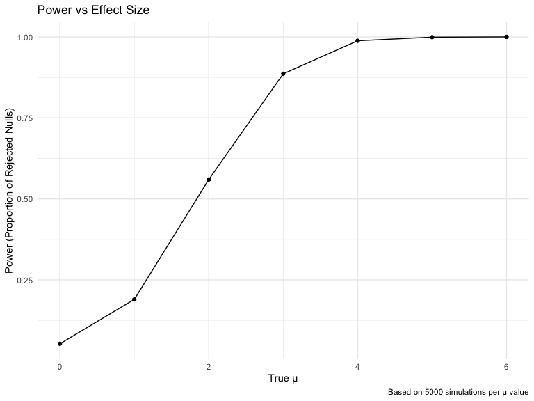

p8105_hw5_yg2964
================
2024-11-14

### Problem 1

Function to simulate birthdays and check for duplicates

``` r
bday_sim = function(n){
bdays = sample(1:365, size = n, replace=TRUE)

duplicate = length(unique(bdays))<n
return(duplicate)
}
```

Run simulations for group sizes 2 to 50

``` r
sim_res =
  expand_grid(
    n = 2:50,
    iter = 1:10000
  ) |> 
  mutate(res = map_lgl(n,bday_sim)) |> 
  group_by(n) |> 
  summarize(probability = mean(res))
```

Create visualization

``` r
sim_res |>
  ggplot(aes(x = n, y = probability)) +
  geom_line(size = 1) +    # Removed color specification to use viridis default
  labs(
    title = "Probability of Shared Birthdays by Group Size",
    x = "Number of People in Group",
    y = "Probability of Shared Birthday",
    caption = "Based on 10,000 simulations per group size"
  ) +
  scale_y_continuous(labels = scales::percent)
```


The plot clearly illustrates the famous “birthday paradox” showing the
probability of shared birthdays as group size increases. The probability
grows surprisingly quickly: with just 23 people, there’s already a 50%
chance of a shared birthday, rising to about 70% with 30 people, and
exceeding 85% with 40 people. This counter-intuitive result shows how we
typically underestimate the probability of birthday matches in
relatively small groups. The simulation, run 10,000 times per group
size, presents these findings in a clear way.

### Problem 2

Function to generate data and perform t-test

``` r
# Set parameters
n <- 30          # sample size
sigma <- 5       # standard deviation
n_sims <- 5000   # number of simulations per mu value
alpha <- 0.05    # significance level
run_simulation <- function(true_mu) {
  # Initialize vectors to store results
  p_values <- numeric(n_sims)
  estimates <- numeric(n_sims)
  
  # Run simulations
  for(i in 1:n_sims) {
    # Generate data
    data <- rnorm(n, mean = true_mu, sd = sigma)
    
    # Perform t-test
    test_result <- t.test(data, mu = 0)
    
    # Store results
    p_values[i] <- test_result$p.value
    estimates[i] <- test_result$estimate
  }
  
  # Return results as a data frame
  data.frame(
    true_mu = true_mu,
    p_value = p_values,
    estimate = estimates,
    rejected = p_values < alpha
  )
}
```

Run simulations for different mu values

``` r
mu_values <- c(0, 1, 2, 3, 4, 5, 6)
all_results <- do.call(rbind, lapply(mu_values, run_simulation))
```

Calculate summary statistics

``` r
summary_stats <- all_results %>%
  group_by(true_mu) %>%
  summarize(
    power = mean(rejected),
    avg_est_all = mean(estimate),
    avg_est_rejected = mean(estimate[rejected])
  )
```

Plot 1: Power vs True mu

``` r
power_plot <- ggplot(summary_stats, aes(x = true_mu, y = power)) +
  geom_line() +
  geom_point() +
  labs(
    title = "Power vs Effect Size",
    x = "True μ",
    y = "Power (Proportion of Rejected Nulls)",
    caption = "Based on 5000 simulations per μ value"
  )
print(power_plot)
```



Plot 2: Average Estimates

``` r
estimates_plot <- ggplot(summary_stats) +
  geom_line(aes(x = true_mu, y = avg_est_all, color = "All Samples")) +
  geom_point(aes(x = true_mu, y = avg_est_all, color = "All Samples")) +
  geom_line(aes(x = true_mu, y = avg_est_rejected, color = "Rejected Nulls Only")) +
  geom_point(aes(x = true_mu, y = avg_est_rejected, color = "Rejected Nulls Only")) +
  geom_abline(intercept = 0, slope = 1, linetype = "dashed", alpha = 0.5) +
  labs(
    title = "Average Estimates vs True μ",
    x = "True μ",
    y = "Average Estimate",
    color = "Sample Type",
    caption = "Dashed line represents y = x"
  ) 
print(estimates_plot)
```


